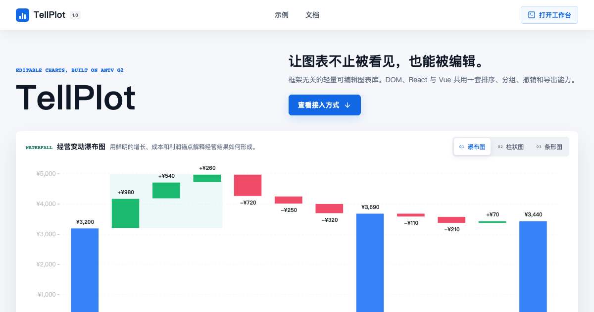

<p align="center">
  <a href="https://tellplot.com" aria-label="TellPlot 官网">
    
  </a>
</p>

<h1 align="center">TellPlot</h1>

<p align="center">
  <strong>基于 AntV G2 的可编辑财务叙事图表。</strong>
</p>

<p align="center">
  在不改写原始数据的前提下，对瀑布图、单序列或 2 至 4 序列的分类条形图和柱状图进行<br>
  排序、分组、注释与导出。
</p>

<p align="center">
  <a href="README.en.md">English</a> · <a href="README.md">简体中文</a>
</p>

<p align="center">
  <a href="https://www.npmjs.com/package/tellplot"></a>
  <a href="https://github.com/iiwish/tellplot/actions/workflows/ci.yml"></a>
  <a href="https://www.npmjs.com/package/tellplot"></a>
  <a href="LICENSE"></a>
</p>

<p align="center">
  <a href="https://tellplot.com">官网</a> ·
  <a href="https://tellplot.com/examples">示例</a> ·
  <a href="https://tellplot.com/docs">文档</a> ·
  <a href="https://tellplot.com/playground">在线工作台</a>
</p>

<a href="https://tellplot.com/playground">
  
</a>

## 为什么选择 TellPlot

大多数图表库帮助你绘制数据。TellPlot 还让用户能够组织数据背后的叙事。

- **编辑叙事，不修改来源。** 排序、递归分组、折叠状态、注释和强调保存在独立的 `ViewSpec`
  中，宿主持有的 `SourceData` 始终不可变。
- **一套编辑器，多种宿主。** imperative DOM、React 18/19 和 Vue 3 共用同一个框架无关 runtime。
- **比较多序列，不牺牲可编辑性。** 分类条形图与柱状图支持 source-ordered 的 2 至 4 序列
  dense values matrix，并与 scalar 数据共用同一套叙事编辑命令。
- **每个动作都确定可重放。** 图表直接操作、结构大纲、键盘和宿主命令进入同一套类型化命令模型，
  并共享撤销与重做。
- **所见即可交付。** SVG 与 PNG 导出保留当前顺序、分组、序列、标签、注释和视觉语义。
- **核心有意保持轻量。** TellPlot runtime 不发起网络请求，也不捆绑 Dashboard、AI 层、服务端工作流
  或通用插件系统。

## 快速开始

当前文档对应本地 `tellplot@2.0.0` candidate。在已有宿主项目中安装经验证的候选制品：

```bash
pnpm add ./tellplot-2.0.0.tgz
```

`2.0.0` 正式发布到 registry 后，宿主可改用 `pnpm add tellplot@^2.0.0`。当前说明不表示 2.0 已发布。

在任意浏览器应用中创建可编辑的多序列柱状图：

```ts
import { createEditor } from 'tellplot';
import 'tellplot/styles.css';

const host = document.querySelector<HTMLElement>('#chart');
if (!host) throw new Error('Missing chart host');

const editor = createEditor(host, {
  config: {
    type: 'column',
    data: {
      schemaVersion: '3.0.0',
      dataKind: 'categorical',
      datasetId: 'actual-versus-budget',
      series: [
        { id: 'actual', label: '实际' },
        { id: 'budget', label: '预算' },
      ],
      items: [
        {
          id: 'north',
          label: '华北',
          values: [
            { seriesId: 'actual', amount: 128 },
            { seriesId: 'budget', amount: 135 },
          ],
        },
        {
          id: 'south',
          label: '华南',
          values: [
            { seriesId: 'actual', amount: 116 },
            { seriesId: 'budget', amount: 108 },
          ],
        },
      ],
    },
    locale: 'zh-CN',
  },
});

// 宿主卸载时释放 DOM、G2 和事件资源。
window.addEventListener('pagehide', () => editor.destroy(), { once: true });
```

同一份 `ChartConfig` 可以通过适合宿主应用的任意入口接入：

| 环境            | 导入路径              | 入口                               |
| --------------- | --------------------- | ---------------------------------- |
| 浏览器 / DOM    | `tellplot`            | `createEditor(container, options)` |
| React 18 或 19  | `tellplot/react`      | `<ChartEditor />`                  |
| Vue 3           | `tellplot/vue`        | `<ChartEditor />`                  |
| 无 DOM 领域能力 | `tellplot/core`       | 校验、命令、持久化                 |
| 编辑器样式      | `tellplot/styles.css` | 一份共享样式表                     |

[入门与集成指南](docs/getting-started.md)提供完整 DOM、React、Vue 示例，以及受控与非受控状态、
图像导出和生命周期规则。

## 完整能力

| 能力     | 已包含                                                                |
| -------- | --------------------------------------------------------------------- |
| 图表家族 | 瀑布图、scalar categorical 条形图/柱状图、2 至 4 序列 comparison categorical |
| 叙事编辑 | 排序、递归分组、折叠、展开、固定、注释、强调                                  |
| 精确操作 | 图表直接操作、结构大纲、键盘访问、宿主命令                                    |
| 状态     | 不可变来源数据、版本化 `ViewSpec`、确定性历史、撤销与重做                       |
| 呈现     | 标题、语义颜色、坐标轴、标签、Tooltip、数字格式、动画、序列图例                    |
| 输出     | SVG、PNG、可序列化的 `ViewSpec` JSON                                  |
| 质量     | TypeScript strict、ESM/CJS、可访问性、reduced motion、跨浏览器矩阵             |

## 核心模型

TellPlot 有意把宿主数据、呈现意图和用户编辑拆分为不同合同：

| 合同          | 所有者      | 用途                                             |
| ------------- | ----------- | ------------------------------------------------ |
| `SourceData`  | 宿主        | 不可变数值、维度、稳定 ID、序列与来源引用     |
| `ChartConfig` | 宿主        | 图表家族、外观、编辑能力、locale 与尺寸          |
| `ViewSpec`    | 宿主/编辑器 | 顺序、层级、折叠、固定、注释与强调               |
| Commands      | 共享核心    | 在视图状态之间执行经过校验、可重放、可撤销的转换 |

AntV G2 始终是唯一的图表渲染和图形动画引擎。TellPlot 负责类型化数据合同、叙事状态、交互、持久化与
导出生命周期；它不暴露原始 G2 instance，也不接受任意 `G2Spec` 覆盖。

## 文档

| 指南                                  | 内容                                   |
| ------------------------------------- | -------------------------------------- |
| [入门与集成](docs/getting-started.md) | DOM、React、Vue、受控状态、导出        |
| [公共 API](docs/api.md)               | runtime 入口、类型、事件、instance API |
| [数据合同](docs/data-contract.md)        | schema 3.0、scalar 与 comparison 数据 |
| [配置边界](docs/configuration.md)     | 安全外观配置与编辑器选项               |
| [错误处理](docs/errors.md)            | 校验与可恢复 runtime 失败              |
| [架构概览](docs/architecture.md)      | 包边界与 G2 ownership                  |
| [迁移与兼容](docs/migration.md)       | 1.x 到 2.x breaking 数据与状态迁移          |
| [版本政策](docs/versioning.md)        | 兼容、支持与弃用政策                   |

产品、路线图与交付文档入口见[文档索引](docs/README.md)。

## 本地开发

TellPlot 使用 Node 22 和 pnpm 11.1.3。

```bash
git clone https://github.com/iiwish/tellplot.git
cd tellplot
corepack enable
pnpm install --frozen-lockfile
pnpm dev
```

提交 Pull Request 前运行主要质量门禁：

```bash
pnpm format:check
pnpm lint
pnpm typecheck
pnpm test:unit
pnpm build
pnpm test:package
pnpm test:framework-matrix
```

行为变更默认先写失败测试。财务聚合、顺序和层级变化必须包含不变量测试。完整浏览器、可访问性、
性能与 Pull Request 要求见 [CONTRIBUTING.md](CONTRIBUTING.md)。

## 社区

- 集成问题与最小复现请先阅读[支持指南](SUPPORT.md)。
- 可复现缺陷和明确图表需求请使用 [Issue 选择器](https://github.com/iiwish/tellplot/issues/new/choose)。
- 安全漏洞请通过 [Security Advisory 私有入口](https://github.com/iiwish/tellplot/security/advisories/new)
  报告。
- 参与社区须遵守[行为准则](CODE_OF_CONDUCT.md)。

## 许可证

TellPlot 基于 [MIT License](LICENSE) 开源。

本仓库当前生成本地 `tellplot@2.0.0` candidate；这不表示 npm、Git tag、GitHub Release 或 Production 已发布。
已发布的 `tellplot@1.0.0` lineage 保持独立且不可改写。
