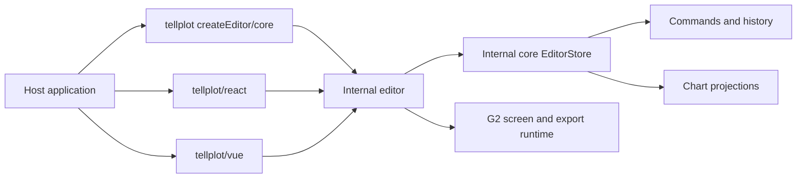

# TellPlot 架构概览

TellPlot 采用 core、imperative editor 和 framework adapter 内部分层，对外只发布一个 `tellplot` 包。编辑
能力只实现一次，npm 分发数量不改变代码所有权。



## Core layer

`core` 包含 schema、配置校验、领域不变量、命令执行、undo/redo、持久化、waterfall/categorical
projection、pointer geometry 和 `EditorStore`。它不依赖 DOM、G2、React 或 Vue，Node/SSR import 不产生
浏览器副作用。

`SourceData` 保存不可变事实；`ViewSpec` 保存顺序、递归分组、折叠、固定、注释和强调。直接操作、大纲、
键盘和宿主调用都构造同一种命令并进入同一 session。

## Imperative editor layer

`createEditor` 在调用时创建稳定 DOM workbench 和 G2 runtime。工作台拥有 toolbar、反馈、大纲、图表、
inspector、overlay、无障碍摘要、直接操作、历史与导出。更新通过 `EditorStore` snapshot 增量刷新，不通过
framework render tree 间接驱动 G2。

```text
packages/editor/src/
  editor/              # imperative instance、DOM workbench、outline、chart surface
  charts/              # family G2 specs 与 group regions
  rendering/g2/        # screen/offscreen G2 lifecycle
  export/              # SVG sanitizer、PNG encoding、export options
  styles/              # canonical workbench stylesheet
```

G2 事件只在 `chartSurface` 边界转为稳定 point、datum 和 scene bounds。排序读取 G2 scene geometry，不猜测
柱宽；waterfall/column 使用 X category axis，bar 使用 Y category axis。

## Framework adapters

React 和 Vue 子路径只创建一个宿主元素，将 props 映射为 `createEditor/update`，将 ref/expose 映射到窄 handle，
并在卸载时调用 `destroy`。它们不包含 EditorStore、命令、G2、编辑 UI 或第二套状态。

## 生命周期

1. import core/editor 不访问 DOM。
2. `createEditor(container, options)` 获得容器所有权并创建资源。
3. `update` 替换 config/view/callback contract，保留 instance 和 container。
4. `destroy` 幂等释放异步 render、G2 events、document/window listeners、media query、DOM 和所有权。

## 依赖方向

```text
packages/react -> packages/editor -> packages/core
packages/vue   -> packages/editor -> packages/core
packages/editor -> G2
packages/core -X-> DOM / G2 / React / Vue
```

`packages/tellplot` 只组装上述稳定入口并生成一个 tarball。仓库 architecture gate 解析全部内部 runtime
import graph、拒绝循环、拒绝 core/editor framework 依赖并阻止 React/Vue 交叉依赖。
